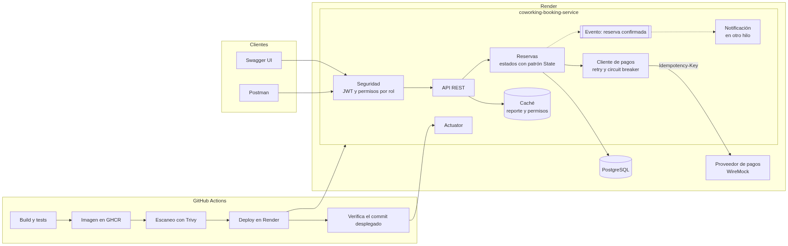
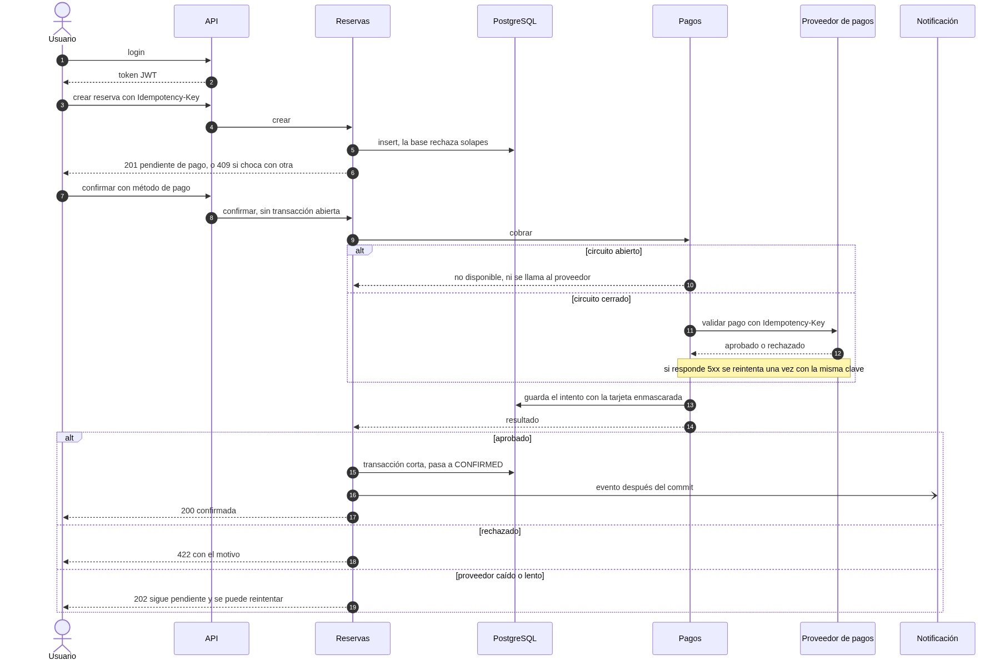

# 🏢 Coworking Booking Service

Microservicio REST para gestionar reservas de espacios de coworking.

## Qué hace

- CRUD de espacios (salas, escritorios, oficinas privadas).
- Registro y login con JWT. Hay roles ADMIN y USER, y los permisos de cada rol se pueden cambiar por API.
- Reservas sin solapamiento: un espacio no se puede reservar dos veces en el mismo horario. Cada usuario ve y gestiona las suyas, el admin ve todas.
- Confirmación con pago: se valida contra un proveedor externo (simulado con WireMock) protegido con circuit breaker.
- Al confirmar una reserva se manda una notificación en segundo plano.
- Reporte de ocupación por espacio y rango de fechas, cacheado.

## Stack técnico

| Área | Tecnología |
|------|------------|
| Lenguaje / framework | Java 21, Spring Boot 3.5 |
| Persistencia | PostgreSQL 17, Spring Data JPA, Flyway |
| Seguridad | Spring Security, OAuth2 Resource Server (JWT) |
| Resiliencia | Resilience4j: circuit breaker y retry (Spring Cloud Circuit Breaker) |
| Documentación API | springdoc-openapi (Swagger UI) |
| Tests | JUnit 5, Testcontainers |
| Empaquetado / CI | Docker (multi-arch), GitHub Actions, GHCR |

## Cómo arrancarlo

Requisitos: Docker. Para el flujo de desarrollo, además JDK 21.

### En producción (Render)

Está desplegado y se puede probar sin instalar nada:

| | URL |
|--|--|
| Swagger UI | https://coworking-booking-service-ujuk.onrender.com/coworking-service/swagger-ui.html |
| API | https://coworking-booking-service-ujuk.onrender.com/coworking-service/api/v1 |
| Health | https://coworking-booking-service-ujuk.onrender.com/coworking-service/actuator/health |
| Proveedor de pagos (WireMock) | https://coworking-payments-mock.onrender.com |

Admin de evaluación: `admin@coworking.com` / `Admin12345!`.

Es el plan gratis de Render: si nadie la usa por un rato, la app y el mock se duermen y la primera petición tarda unos segundos. Por lo mismo, el primer `confirm` después de un rato puede responder 202 (el proveedor tardó más de 2 s en despertar); el siguiente ya responde normal.

### Stack completo (PostgreSQL + WireMock + app)

```bash
docker compose up
```

| Servicio | URL |
|----------|-----|
| API | http://localhost:8080/coworking-service/api/v1 |
| Swagger UI | http://localhost:8080/coworking-service/swagger-ui.html |
| OpenAPI (JSON) | http://localhost:8080/coworking-service/v3/api-docs |
| Health | http://localhost:8080/coworking-service/actuator/health (detalle solo ADMIN) |
| Info | http://localhost:8080/coworking-service/actuator/info |
| Métricas | http://localhost:8080/coworking-service/actuator/metrics (solo ADMIN) |
| Circuit breakers | http://localhost:8080/coworking-service/actuator/circuitbreakers (solo ADMIN) |
| WireMock | http://localhost:8081 |
| PostgreSQL | `localhost:5433` (db, usuario y contraseña: `coworking`) |

La app corre con el perfil `prod` y construye su imagen desde el `Dockerfile` del repositorio.

Administrador inicial: `manuel.admin@coworking.com` / `Admin123!`. El token se obtiene con `POST /auth/login` y se envía como `Authorization: Bearer <token>`.

Para confirmar una reserva (`POST /reservations/{id}/confirm`) se manda el método de pago, con tarjeta:

```json
{ "paymentMethod": { "type": "CARD", "token": "tok_visa_4242" } }
```

o con transferencia:

```json
{ "paymentMethod": { "type": "BANK_TRANSFER", "accountNumber": "SV62CENR00000000000000700025" } }
```

WireMock hace de proveedor de pagos y responde según lo que recibe:

| Caso | Respuesta del proveedor | Resultado |
|------|-------------------------|-----------|
| cualquier tarjeta o cuenta válida | `APPROVED` | 200, reserva `CONFIRMED` con `paymentReference` |
| token `tok_insufficient_funds` | `DECLINED` | 422 `PAYMENT_INSUFFICIENT_FUNDS` |
| token `tok_expired` | `DECLINED` | 422 `PAYMENT_CARD_EXPIRED` |
| cuenta que empieza por `SV00` | `DECLINED` | 422 `PAYMENT_METHOD_INVALID` |
| reserva de importe 555 | 503 | se reintenta una vez; luego 202 y sigue `PENDING_PAYMENT` |
| reserva de importe 333 | tarda 3 s | 202 al pasar el timeout de 2 s |

Cada intento queda guardado y se puede ver en `GET /reservations/{id}/payments`.

Si el proveedor falla 5 veces seguidas, el circuito se abre 30 s. Mientras está abierto, `confirm` responde 202 al instante sin llamar al proveedor. El estado se puede ver en `/actuator/circuitbreakers` y en `/actuator/health`.

### Desarrollo local

```bash
cp .env.example .env                              # una sola vez
docker compose up -d postgres                     # solo la base de datos, en localhost:5433
set -a; source .env; set +a && ./gradlew bootRun  # perfil "dev" por defecto
```

Hook de git (una sola vez): `git config core.hooksPath .githooks`. Bloquea el `git push` si `./gradlew build` falla. Requiere Docker encendido (los tests usan Testcontainers); en una emergencia se omite con `git push --no-verify`.

`application-dev.yml` no tiene valores por defecto: las variables de `.env` son obligatorias. Spring no lee `.env` por sí solo; en IntelliJ se carga con el plugin **EnvFile** (Settings → Plugins → buscar "EnvFile"), activándolo en Run/Debug Configurations → pestaña EnvFile → agregar `.env`.

### Postman

La colección está en `postman/`, con dos entornos: `local` y `prod-render`. Importa ambos y córrela en orden:

- **00 · Sesión**: login del admin y del usuario. Siempre primero.
- **01 · Flujo completo**: crear espacio, reservar, pagar y ver la ocupación.
- **02 · Mantenimientos**: espacios, roles y usuarios.
- **03 · Lógica de negocio**: reservas, pagos y reporte cuando todo sale bien.
- **04 · Casos de prueba**: validaciones, permisos, rechazos y fallas del proveedor.
- **05 · Operación**: actuator y Swagger.

Cada request guarda lo que necesita el siguiente y trae sus propias pruebas. Desde la terminal:

```bash
npx newman run postman/coworking-booking-service.postman_collection.json \
  -e postman/environments/local.postman_environment.json
```

### Tests

```bash
./gradlew build
```

Los tests levantan su propio PostgreSQL con Testcontainers, así que hace falta Docker encendido.

- Unitarios con Mockito para las reglas de negocio de espacios, usuarios, roles, reservas y el reporte.
- De integración (`*IT`), con la app completa, JWT real y PostgreSQL + WireMock en contenedores (usan los mismos mappings de `wiremock/`):
  - `PaymentConfirmationIT`: tarjeta y transferencia aprobadas, cada motivo de rechazo, pagar con otra tarjeta después de un rechazo, validación del método de pago, proveedor lento, el reintento con la misma `Idempotency-Key` (revisando lo que llegó a WireMock), el circuito abriéndose y la notificación asíncrona.
  - `ReservationConcurrencyIT`: 20 reservas al mismo tiempo para el mismo horario. Una sola gana (201), las otras 19 reciben 409 y en la base queda una fila. También revisa que dos reservas seguidas (9-10 y 10-11) enviadas a la vez pasen las dos.
  - `OccupancyReportIT`: el cálculo del reporte, que se cachea y que se actualiza al confirmar o cancelar.
  - `ReservationQueryIT`: cada usuario ve solo sus reservas, el admin ve todas, y los filtros del listado.
  - `AdminApiIT`: roles, usuarios, bloqueo de cuentas y permisos que cambian con el mismo token.
  - `SpaceApiIT` y `ApiErrorsIT`: el CRUD de espacios y que todos los errores salgan con el mismo formato.

La cobertura se mide con JaCoCo (reporte en `build/reports/jacoco/test/html/index.html`) y el build falla si baja del 90% de líneas.

## Arquitectura

Así se conectan las piezas y cómo llega cada cambio a producción:



Y esto es lo que pasa cuando alguien reserva y paga:



Fuente editable de ambos en `docs/diagrams/*.mmd` (Mermaid).

Organización del código:

```
com.cowork.booking
├── space/            # dominio: espacios reservables
│   ├── controller/   # entrada HTTP, valida y delega
│   ├── service/      # lógica de negocio, @Transactional
│   ├── repository/   # acceso a datos, Spring Data JPA
│   ├── model/        # entidad JPA (@Entity)
│   ├── dto/          # contrato de la API, nunca expone entidades JPA
│   └── mapper/       # entidad (model/) <-> DTO
├── user/             # dominio: usuarios y roles
│   ├── controller/
│   ├── service/
│   ├── repository/
│   ├── model/        # entidad JPA (@Entity)
│   ├── dto/
│   └── mapper/
├── reservation/      # dominio: reservas (regla de no solapamiento vive aquí)
│   ├── controller/
│   ├── service/
│   ├── repository/
│   ├── model/        # entidad JPA y estados (patrón State)
│   ├── dto/
│   ├── mapper/
│   └── event/        # eventos de dominio (ReservationConfirmedEvent)
├── payment/          # método de pago, cliente del proveedor (retry + circuit breaker) e historial de intentos
├── notification/     # escucha eventos de reservas y notifica de forma asíncrona
├── report/           # reporte de ocupación cacheado
├── common/           # excepciones de negocio y @ControllerAdvice (transversal)
└── config/           # @ConfigurationProperties, seguridad, OpenAPI (transversal)
```

Cada dominio sigue el flujo `controller → service → repository`, sin saltarse capas.

```
src/main/resources
├── application.yml       # configuración base, se combina con el perfil activo
├── application-dev.yml   # datasource local, Flyway activado
└── application-prod.yml  # valores desde variables de entorno
```

## Por qué usé cada pieza

**JPA, `@Query` y Specifications.** Las relaciones son `@ManyToOne` LAZY y, donde hace falta traer el espacio y el usuario de una reserva, uso `@EntityGraph` para hacerlo en una sola consulta (sin N+1). Los filtros opcionales de los listados van con Specifications, en vez de un método de repositorio por combinación. El reporte usa `@Query` nativa porque necesita `LEAST/GREATEST` sobre fechas. Las entidades tienen `@Version`: si dos personas editan lo mismo a la vez, la segunda recibe 409.

**Spring Security con JWT.** La API no guarda sesión, así que un token firmado encaja bien. Lo emite la propia app y dura 1 h. La autorización va por permisos (`hasAuthority`), no por nombre de rol, así un rol nuevo funciona sin tocar código.

**Bean Validation y `@RestControllerAdvice`.** Los DTOs se validan con anotaciones y los mensajes salen en español. Todos los errores pasan por `GlobalExceptionHandler` con el mismo formato (ProblemDetail) y un `code` estable. Las excepciones de negocio son propias: `ResourceNotFoundException` → 404, `BusinessRuleException` → 409 y `UnprocessableOperationException` → 422. No hice una clase por error: el `code` (`RESERVATION_OVERLAP`, `PAYMENT_CARD_EXPIRED`…) ya distingue cada caso.

**`@Transactional`.** Los servicios son `readOnly` por defecto y solo las escrituras abren transacción. Crear una reserva revisa el solapamiento y guarda en la misma transacción; la constraint de la base cubre las peticiones simultáneas. Confirmar es distinto, lo explico más abajo.

**Actuator.** `health`, `info`, `metrics`, `circuitbreakers` y `retries`, más una métrica propia, `payments.attempts`. Health es público sin detalle; lo demás solo lo ve un admin. `info` muestra el commit desplegado y el pipeline lo usa para confirmar que Render tiene la versión nueva.

**Perfiles y `@ConfigurationProperties`.** `application.yml` tiene lo común, `dev` lo local y `prod` lee todo de variables de entorno. La configuración propia está en records con `@ConfigurationProperties` + `@Validated`: si falta un valor, la app no arranca y dice cuál. No hay `@Value` sueltos. No hice perfiles `qa` o `stg`: como `prod` no tiene valores fijos, cualquier ambiente corre la misma imagen y solo cambia sus variables. Para los tests hay un perfil `test`.

**Caché.** Solo para el reporte y los permisos de cada usuario, que se leen mucho y cambian poco. En memoria, porque para una instancia alcanza.

**`@Async` y eventos.** La notificación no tiene por qué hacer esperar al usuario, así que sale en otro hilo a partir de un evento.

**OpenAPI.** springdoc genera la documentación desde los controllers. Cada endpoint dice qué permiso pide y qué errores devuelve.

**Tests.** Mockito para las reglas de negocio y `@SpringBootTest` con Testcontainers para lo que un mock no demuestra: la constraint con peticiones simultáneas, el circuit breaker contra un WireMock real y la caché. Postgres de verdad y no H2, porque H2 no tiene `EXCLUDE USING gist`.

**Docker.** `Dockerfile` multi-stage: compila con el JDK y la imagen final solo lleva el JRE, con un usuario sin privilegios. `docker compose up` levanta la base, el mock y la app, que espera a que los otros dos estén sanos.

**Librerías que no pedía la prueba.**
- **Flyway**: el esquema vive en migraciones y Hibernate solo lo valida. Nadie cambia tablas a mano.
- **Lombok**: solo `@Getter`, `@RequiredArgsConstructor` y `@Slf4j`. Nada de `@Data` ni setters en entidades; los cambios pasan por métodos del dominio.
- **hibernate-jpamodelgen**: las Specifications usan campos con tipo (`Space_.name`) en vez de strings, así un campo renombrado falla al compilar.
- **Módulo de WireMock para Testcontainers**: levanta en los tests el mismo mock de `docker compose`. Está en alpha, pero es el que recomienda WireMock y solo corre en tests.
- **Bouncy Castle 1.85, Tomcat y driver de PostgreSQL**: versiones forzadas en `build.gradle` porque Trivy marcó vulnerabilidades en las que venían.

## Decisiones y trade-offs

### Paquetes por dominio
Agrupé por dominio (`space`, `reservation`, `payment`...) y no por capa: cada uno tiene lo suyo junto y sería fácil sacarlo a otro servicio. A cambio, las carpetas `controller/service/repository` se repiten.

### Roles y permisos dinámicos
Los roles se editan por API; los permisos son un catálogo fijo porque el código los revisa. El JWT solo dice quién es el usuario: sus permisos y si está bloqueado se leen de la base (con caché), así un cambio aplica al momento. Al ADMIN no se le pueden quitar `USER_MANAGE` ni `RBAC_MANAGE`, para no quedarse sin administrador.

### Reservas que no se pisan
El servicio revisa el solapamiento para dar un error claro, pero con dos peticiones al mismo tiempo eso no alcanza. Por eso también está en PostgreSQL con un `EXCLUDE USING gist`: si llegan juntas, pasa una y la otra recibe 409. No usé locks en Java porque no sirven con varias instancias. El rango es `[inicio, fin)`: 9 a 10 y 10 a 11 conviven.

### Patrón State
Una reserva solo se confirma si está pendiente de pago y solo se cancela si no está cancelada. Con `if/else` o `switch`, esa regla se repite en cada operación y cada estado nuevo obliga a revisarlos todos. Con State, cada estado es una clase que dice qué transiciones permite (interfaz sealed) y la entidad solo le pide el cambio al estado actual. Un estado `COMPLETED` sería una clase más. Además se revisa antes de cobrar: si no se puede confirmar, no se llama al proveedor.

### Patrón Observer: notificación asíncrona
Confirmar dispara cosas que no son parte de confirmar: hoy la notificación, mañana quizá una factura. El servicio publica `ReservationConfirmedEvent` y cada interesado se suscribe, sin tocar `ReservationService`. El listener usa `@TransactionalEventListener(AFTER_COMMIT)` y `@Async`: solo notifica lo que quedó guardado y no hace esperar al usuario. Por ahora es un log. El punto débil: si la app cae entre el commit y el envío, esa notificación se pierde; para evitarlo haría falta un outbox.

### Idempotency-Key al crear reservas
Si el cliente reintenta con la misma clave (por un timeout, por ejemplo), recibe la reserva ya creada en vez de una duplicada.

### Pago con circuit breaker
La llamada al proveedor va fuera de la transacción, para no tener una conexión a la base ocupada mientras espera. Si se aprueba, una transacción corta pasa la reserva a `CONFIRMED`. Si el proveedor falla, tarda más de 2 s o el circuito está abierto, la reserva sigue en `PENDING_PAYMENT` y se responde 202. Un rechazo no es culpa del proveedor: responde 422 y no cuenta para el circuito. El circuito se ve en `/actuator/health` pero no lo pone en DOWN, para que Render no reinicie la app por culpa de un tercero.

### Método de pago y reintentos
`confirm` recibe una tarjeta tokenizada (nunca el número) o una cuenta para transferencia. Cada tipo es un record con sus validaciones y Jackson elige según el campo `type`: un método nuevo es un record más, sin `if` por tipo.

Si el proveedor responde 5xx, reintento una vez; los timeouts no, porque el usuario esperaría el doble. Reintentar un cobro solo es seguro si no se cobra dos veces, así que cada llamada lleva un `Idempotency-Key` que sale de la reserva y del método: el mismo cobro lleva la misma clave, otra tarjeta genera una nueva.

Cada intento queda en `payment_attempts` y se ve en `GET /reservations/{id}/payments`: si alguien dice "me cobraron", ahí está lo que pasó. El token o la cuenta nunca se guardan ni se loguean completos, solo los últimos 4 caracteres.

### Reporte de ocupación con caché
Una sola consulta suma las horas confirmadas de cada espacio dentro del rango (recortando las reservas que cruzan los bordes) y las divide entre 24 h por día en UTC. Solo cuentan las `CONFIRMED`, porque una pendiente puede no pagarse nunca. Se guarda con `@Cacheable` y se limpia con `@CacheEvict` al confirmar, cancelar o cambiar un espacio. La limpieza espera al commit, así un reporte pedido justo en medio no guarda datos viejos.

### Swagger abierto en prod
Para que se pueda probar sin montar nada. En un entorno real lo cerraría desde la infraestructura, no desde el código.

### Credenciales
El admin se crea al arrancar con `ADMIN_EMAIL` y `ADMIN_PASSWORD`, y `JWT_SECRET` firma los tokens. Los valores del README, `.env.example` y `docker-compose.yml` son solo para la evaluación; en producción irían en un gestor de secretos.

## Fuera de alcance y qué haría con más tiempo

Dejé fuera a propósito:

- Notificaciones reales (email, SMS, colas) y el outbox para no perder ninguna.
- Un proveedor de pagos real. Tanto en local como en Render el proveedor es un WireMock con respuestas fijas.
- Reintentar solos los pagos pendientes o hacer vencer las reservas sin pagar. Hoy se reintenta llamando otra vez a `confirm`.
- Caché compartida entre instancias (Redis).
- Refresh tokens. El token dura 1 h, aunque bloquear a un usuario o cambiarle el rol aplica al instante.
- Horarios de apertura y zonas horarias por sede. El reporte asume 24 h en UTC.
- Reembolsos al cancelar una reserva ya pagada.
- Rate limiting; eso lo dejaría al gateway.

Con más tiempo, en este orden:

1. Outbox transaccional y un envío de correo real (o una cola), para no perder notificaciones.
2. Estado `COMPLETED` con un job que cierre las reservas ya terminadas, y otro que reintente o venza las pendientes de pago.
3. Strategy para las tarifas (precio distinto por tipo de espacio, horario o duración). Hoy es tarifa × horas.
4. Redis para la caché, para poder correr varias instancias.
5. Refresh tokens y lista de tokens revocados.
6. Pruebas de carga sobre la creación de reservas y tests de contrato del cliente de pagos.
